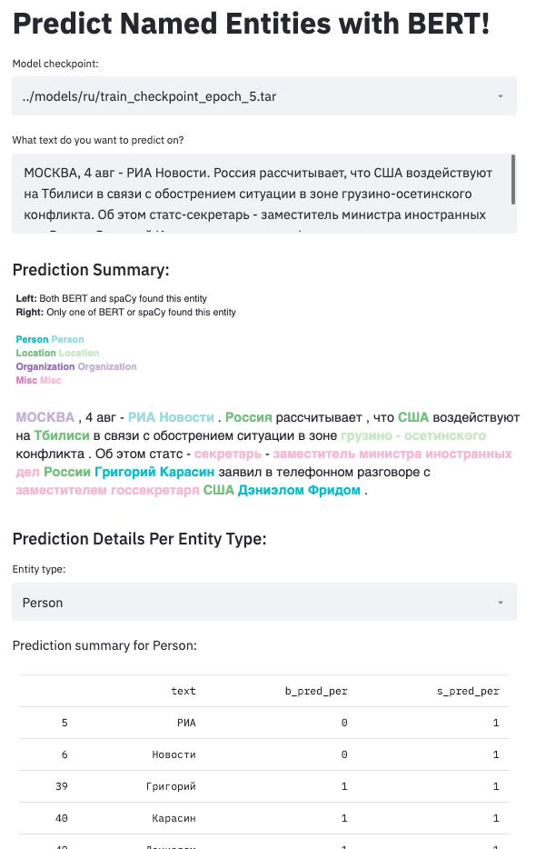
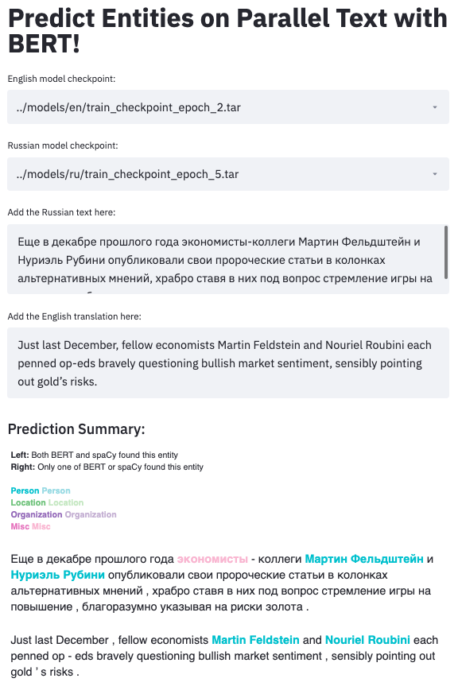

# multilingual_NER

<!-- markdownlint-disable MD033 -->

## About

This repository applies [BERT](https://github.com/google-research/bert) to named entity recognition in English and Russian. The goal is to help developers of machine translation models to analyze and address model errors in the translation of names. More precisely, these NER models will be used as part of a pipeline for improving MT quality estimation between Russian-English sentence pairs.

Named entities are a known challenge in machine translation, and in particular, identifying names in Slavic languages such as Russian presents a unique challenge. Slavic names can vary in spelling depending on what role the name occupies in the sentence (see [Slavic name suffixes](https://en.wikipedia.org/wiki/Slavic_name_suffixes) on Wikipedia for more details). This means an NER model cannot learn to rely on spelling alone, like it could for many English names ("Smith", etc.). In addition, word order in Russian is highly variable, so models cannot necessarily rely on positional cues either.

Since translation is often used in tandem with other information extraction and retrieval techniques, ensuring that names are translated correctly is particularly important for strengthening the usefulness of MT models and the products and services relying on them.

## What's Included

The repo includes:

* Raw and preprocessed data for fine-tuning BERT models in both English and Russian
* Done-for-you training script to train and save a model
* Comprehensive outputs of performance, including confusion matrix and P/R/F1 for every label at each epoch (included in each saved checkpoint)
* Interactive demos for testing the performance of the model on both monolingual and parallel text

## Installation

**NOTE**: Since there are quite a few requirements, creating a virtual environment for this repo is strongly recommended.

### Instructions

Clone or download the repo to your machine.

Use `conda` to create the virtual environment - currently environment creation via `pip` is not supported. Navigate to the `Multilingual_NER` directory and run the following in the command line:

`conda env create -f environment.yml`

You can verify that the required packages installed correctly by activating the environment (`conda activate m_ner`) and running `conda list`.

#### Dependencies

Major dependencies include `pytorch-transformers`, `spacy`, and `streamlit`. Take a look at the `environment.yml` file for a full list. (Note that at the moment, some of the packages in the environment are not strictly necessary, and a leaner environment file will be added down the line.)

## Usage

### Training a model

Use `python main.py` to train an English model and save per-epoch checkpoints. Add `-lang ru` to train a Russian model.

**Before training a Russian model:** A spaCy model is needed for preprocessing the Russian data. If you're training a Russian BERT model, run `python -m spacy download xx_ent_wiki_sm` before running the main script. (It's also needed for the demos later, so might as well get it taken care of now.) The repo comes with the data already preprocessed, so you can also just skip the data preprocessing step by running `python main.py -lang ru -pp False`. `-pp` works to skip preprocessing for English as well.

### Demo for monolingual NER

Once you have a usable model checkpoint, run `streamlit run demo.py en` (or `ru` for Russian), which opens a web app you can use to test the model's predictions interactively. Be sure to download both `xx_ent_wiki_sm` and `en_core_web_lg` before running the demo.

### Demo for parallel NER

In line with the main goal of the project, there is also a demo specifically for testing NER performance on parallel Russian-English sentences. Use `streamlit run parallel_demo.py` to try out the parallel demo. Keep in mind that **you will need to have at least one usable model checkpoint for each language.**

<!-- markdownlint-disable MD033 -->

## Models

* The English model is a fine-tuned implementation of Google's `bert-base-cased` model, ensembled with spaCy's `en_core_web_lg`, which uses a CNN architecture.
* The Russian model is a fine-tuned implementation of Google's `bert-base-multilingual-cased` model, ensembled with spaCy's multilingual `xx_ent_wiki_sm` NER model, which uses a CNN architecture.
* Before running the training script for a Russian model, either of the demos, or either of the spaCy evaluation notebooks, be sure to run `python -m spacy download MODEL_NAME` for both models.

## Data Sources

* The English BERT model was fine-tuned on [CONLL2003](http://aclweb.org/anthology/W03-0419) data and [Emerging Entities '17](https://noisy-text.github.io/2017/emerging-rare-entities.html) data. The Emerging Entities '17 data is composed of informal text (such as tweets), and includes more diverse entity types (such as creative works and products) than CONLL2003, providing the model with the ability to identify MISC entities in addition to the standard person, location, and organization tags.
* The English spaCy model was trained on [OntoNotes](https://catalog.ldc.upenn.edu/LDC2013T19) and uses GloVe word vectors trained on [Common Crawl](https://commoncrawl.org/); see the spaCy docs for more information.
* The Russian model was fine-tuned on data from the [factRuEval-2016](https://github.com/dialogue-evaluation/factRuEval-2016/) shared task, as well as the [Balto-Slavic NLP 2019 Shared Task](http://bsnlp.cs.helsinki.fi/shared_task.html). Both tasks had NER as a focus, and factRuEval-2016 included a general fact-finding task.
* The multilingual spaCy model was trained on Nothman et al. (2010) Wikipedia corpus, and supports PER, LOC, ORG, and MISC entities. See [the spaCy docs](https://spacy.io/models/xx) for more info.
